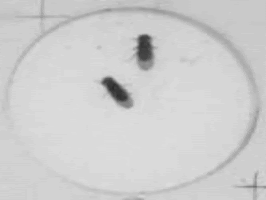
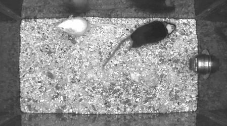
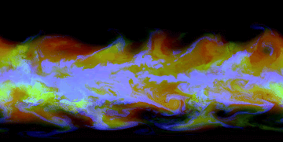
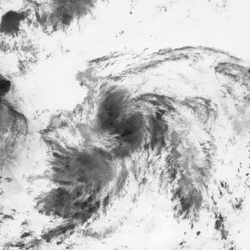
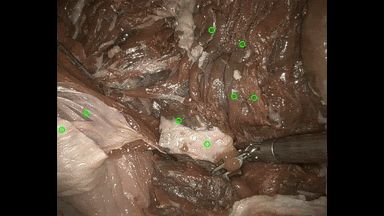
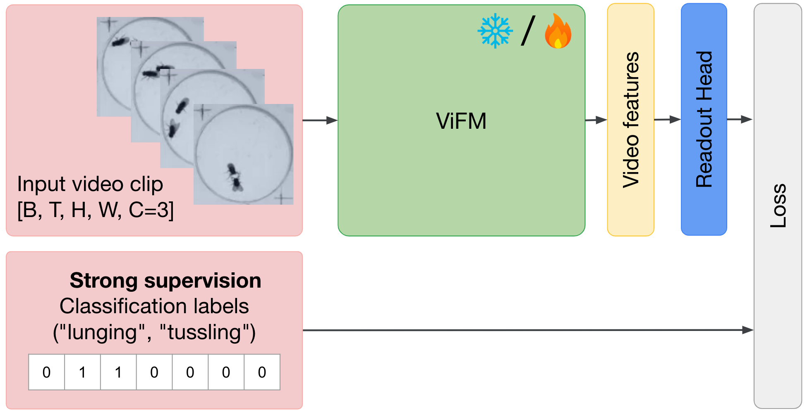

# SciVid: Cross-Domain Evaluation of Video Models in Scientific Applications

Welcome to the official Google DeepMind repository for SciVid, a comprehensive
benchmark for evaluating Video Foundation Models (ViFMs) across multiple
scientific disciplines.

This repository contains:

* [Instructions](https://github.com/google-deepmind/scivid?tab=readme-ov-file#setup-data) to download the datasets in a format compatible with our
evaluations
* [Instructions](https://github.com/google-deepmind/scivid?tab=readme-ov-file#usage) to evaluate pretrained video models on SciVid (eg. [Hugging Face VideoMAE-B backbone](https://huggingface.co/MCG-NJU/videomae-base)), easily extensible to evaluate your own.
* [](https://colab.research.google.com/github/google-deepmind/scivid/blob/master/colabs/demo.ipynb) demo to inspect SciVid benchmark data, models and predictions.

## Overview

SciVid comprises five **Sci**entific **Vid**eo tasks, combining both
established and under-explored tasks across medical computer vision,
animal behavior understanding and weather forecasting, and covering diverse data
distributions and training regimes.

| Dataset           | [FlyVsFly](https://link.springer.com/chapter/10.1007/978-3-319-10605-2_50)                      | [CalMS21](https://arxiv.org/abs/2104.02710)                       | [WeatherBench 2](https://arxiv.org/abs/2308.15560)                  | [Digital Typhoon](https://arxiv.org/abs/2311.02665)                 | [STIR](https://arxiv.org/abs/2309.16782)                           |
|-------------------|-------------------------------|-------------------------------|---------------------------------|---------------------------------|--------------------------------|
| Example     |      |        |  |  |           |
| Domain            | Fly behaviour                 | Mice behaviour                | Weather                         | Typhoon satellite images        | Surgical tissue                |
| Task              | Classification                | Classification                | Forecasting                     | Central pressure forecasting     | Point tracking                 |
| Num train samples | 1M                            | 27K                          | 57K                             | 696                             | N/A                            |

During evaluation, each model is appended with
task-specific readouts and fine-tuned on each downstream dataset, with or
without freezing the backbone.


***Evaluation overview**. For each task, we train a lightweight readout on top of the backbone, which is frozen (❄️) or fine-tuned (🔥).*

In our [paper](TODO), we evaluate the capabilities of a large set of ViFMs,
establishing strong baselines and demonstrating the potential for effective
transfer learning.

## Installation

Installation has been tested with cuda 12.4 and python 3.10.

## Get the code from the GitHub repository

```sh
git clone git@github.com:google-deepmind/scivid.git
```

### Create and activate scivid conda environment

After [installing miniconda](https://www.anaconda.com/docs/getting-started/miniconda/install#linux) if needed, create a conda environment with all required
scivid dependencies.

```sh
conda env create -f scivid/environment.yml
```

This will create a conda environment named `scivid`, which you can activate with

```sh
conda activate scivid
```

## Setup data

### Define local SciVid data directory by setting `SCIVID_DATA_DIR`

Set the `SCIVID_DATA_DIR` environment variable with which will point to the
local scivid data directory.

```sh
export SCIVID_DATA_DIR=/path/to/scivid
```

### Download data

For optimized training, download the data from the [scivid cloud storage bucket](https://storage.googleapis.com/scivid) using

```sh
mkdir -p $SCIVID_DATA_DIR
gsutil -m rsync -r gs://scivid $SCIVID_DATA_DIR
```

Alternatively (slower), you can mount the data using [gcsfuse](https://cloud.google.com/storage/docs/cloud-storage-fuse/overview) in your home folder by running.

```sh
mkdir -p $SCIVID_DATA_DIR
gcsfuse --implicit-dirs scivid $SCIVID_DATA_DIR
```

## Usage

### Manage accelerator visibility and resources

To define which GPU to use and properly manage the accelerator memory, you will
need to set the following environment variables:

```sh
export CUDA_VISIBLE_DEVICES=0
export XLA_PYTHON_CLIENT_MEM_FRACTION=.5
export TF_GPU_ALLOCATOR=cuda_malloc_async
```

What these commands do:

`CUDA_VISIBLE_DEVICES=0` ensures data workers have access to the accelerator
when needed.

`XLA_PYTHON_CLIENT_MEM_FRACTION=.5` reduces jax GPU memory [pre-allocation](https://docs.jax.dev/en/latest/gpu_memory_allocation.html), ensuring enough GPU memory is
available for other processes.

`TF_GPU_ALLOCATOR=cuda_malloc_async` helps prevent out-of-memory errors by
avoiding memory fragmentation issues.

### Increase maximum number of open files

You might need to increase the maximum number of files which can be
simultaneously opened to enable parallelized data preprocessing.

```sh
ulimit -n 4096
```

### Run training

Below, we provide an example training command for training the task-specific
readout using frozen features from the
[VideoMAE-B](https://huggingface.co/MCG-NJU/videomae-base) backbone on the
Fly vs. Fly task.

```sh
python -m kauldron.main --cfg=scivid/configs/launch_config.py:hf_videomae:flyvsfly_classification  --cfg.workdir=/home/${USER}/tmp/exps/flyvsfly_videomae --pdb
```

For WeatherBench2 forecasting, we additionally set
`XLA_FLAGS="--xla_gpu_autotune_level=0"` to avoid memory errors as follows:

```
XLA_FLAGS="--xla_gpu_autotune_level=0" python -m kauldron.main --cfg=scivid/configs/launch_config.py:hf_videomae:weatherbench_future_prediction  --cfg.workdir=/home/${USER}/tmp/exps/weatherbench_videomae --pdb
```

Note that this may slow down training.

## Citing this work

We hope that our work will facilitate further research in cross-domain
development of ViFMs. <br> If you use our SciVid benchmark, please cite:

```
@article{hasson2025scivid,
      title={SCIVID: Cross-Domain Evaluation of Video Models in Scientific Applications},
      author={Hasson, Yana and Luc, Pauline and Momeni, Liliane and Ovsjanikov, Maks and Le Moing, Guillaume and Kuznetsova, Alina and Ktena, Ira and Sun, Jennifer J. and Koppula, Skanda and Gokay, Dilara and Heyward, Joseph and Pot, Etienne and Zisserman, Andrew},
      year={2025},
}
```
<!-- add: journal={arxiv:XXXX}, -->

as well as the benchmarks included in SciVid:

```
@inproceedings{eyjolfsdottir2014flyvsfly,
  title={Detecting social actions of fruit flies},
  author={Eyjolfsdottir, Eyrun and Branson, Steve and Burgos-Artizzu, Xavier P and Hoopfer, Eric D and Schor, Jonathan and Anderson, David J and Perona, Pietro},
  booktitle={ECCV},
  year={2014},
}
```

```
@inproceedings{sun2021calms21,
  title={The multi-agent behavior dataset: Mouse dyadic social interactions},
  author={Sun, Jennifer J and Karigo, Tomomi and Chakraborty, Dipam and Mohanty, Sharada P and Wild, Benjamin and Sun, Quan and Chen, Chen and Anderson, David J and Perona, Pietro and Yue, Yisong and others},
  booktitle={NeurIPS},
  year={2021},
}
```

```
@article{schmidt2024stir,
   title={Surgical Tattoos in Infrared: A Dataset for Quantifying Tissue Tracking and Mapping},
   journal={IEEE Transactions on Medical Imaging},
   publisher={Institute of Electrical and Electronics Engineers (IEEE)},
   author={Schmidt, Adam and Mohareri, Omid and DiMaio, Simon P. and Salcudean, Septimiu E.},
   year={2024},
}
```

```
@article{rasp2024wb2,
  title={Weatherbench 2: A benchmark for the next generation of data-driven global weather models},
  author={Rasp, Stephan and Hoyer, Stephan and Merose, Alexander and Langmore, Ian and Battaglia, Peter and Russell, Tyler and Sanchez-Gonzalez, Alvaro and Yang, Vivian and Carver, Rob and Agrawal, Shreya and others},
  journal={Journal of Advances in Modeling Earth Systems},
  year={2024},
}
```

```
@inproceedings{kitamoto2023typhoon,
 author = {Kitamoto, Asanobu and Hwang, Jared and Vuillod, Bastien and Gautier, Lucas and Tian, Yingtao and Clanuwat, Tarin},
 booktitle = {NeurIPS},
 editor = {A. Oh and T. Naumann and A. Globerson and K. Saenko and M. Hardt and S. Levine},
 title = {Digital Typhoon: Long-term Satellite Image Dataset for the Spatio-Temporal Modeling of Tropical Cyclones},
 year = {2023}
}
```

## Acknowledgements

SciVid's release was made possible by the invaluable contributions of the
following people:

Yana Hasson, Pauline Luc, Lili Momeni, Guillaume Le Moing, Maks Ovsjanikov,
Alina Kuznetsova, Ira Ktena, Jennifer Sun, Dilara Gokay, Etienne Pot,
Phoebe Kirk and Yotam Doron.

We also extend our gratitude to our collaborators at Google.

SciVid uses the following separate libraries and packages:

*   [kauldron](https://github.com/google-research/kauldron)
*   [JAX](https://github.com/jax-ml/jax/)
*   [NumPy](https://github.com/numpy/numpy)
*   [torch](https://pytorch.org/)
*   [hf transformers](https://huggingface.co/docs/transformers/en/index)
*   [xarray](https://docs.xarray.dev/en/stable/)
*   [xarray_tensorstore](https://github.com/google/xarray-tensorstore)
*   [einshape](https://github.com/google-deepmind/einshape)

We thank all their contributors and maintainers!

## License and disclaimer

Copyright 2025 Google LLC

All software is licensed under the Apache License, Version 2.0 (Apache 2.0);
you may not use this file except in compliance with the Apache 2.0 license.
You may obtain a copy of the Apache 2.0 license at:
https://www.apache.org/licenses/LICENSE-2.0

All other materials are licensed under the Creative Commons Attribution 4.0
International License (CC-BY). You may obtain a copy of the CC-BY license at:
https://creativecommons.org/licenses/by/4.0/legalcode

Unless required by applicable law or agreed to in writing, all software and
materials distributed here under the Apache 2.0 or CC-BY licenses are
distributed on an "AS IS" BASIS, WITHOUT WARRANTIES OR CONDITIONS OF ANY KIND,
either express or implied. See the licenses for the specific language governing
permissions and limitations under those licenses.

The SciVid dataset contains preprocessed versions of the following datasets:

- Fly-vs-Fly [1] dataset has been filtered as described by Task Programming [2].
Fly-vs-Fly (California Institute of Technology, Howard Hughes Medical Institute)
is made available pursuant to a CC-0 license at
https://data.caltech.edu/records/zrznw-w7386.
- CalMS21 [3] dataset has been filtered and downsampled, where we have further
held out a subset from the train split for validation. CalMS21 (California
Institute of Technology, Northwestern University) is made available under a
CC-BY license at https://data.caltech.edu/records/s0vdx-0k302.
- STIR dataset [4] has been filtered, downsampled; and query and target points
have been normalized by image dimensions. STIR (The University of British
Columbia, Intuitive Surgical is made available under a CC-BY license at
https://ieee-dataport.org/open-access/stir-surgical-tattoos-infrared.
- Digital Typhoon dataset [5] has been filtered, downsampled and partitioned
into a fixed train/val/test splits. Digital Typhoon (National Institute of
Informatics, Japan, Google Deepmind and several other French, US and Japanese
universities) is made available pursuant to a CC-BY license at
https://agora.ex.nii.ac.jp/digital-typhoon/dataset/index.html.en.
- Movi [6] has been filtered, and preprocessed to generate information relevant
for tracking. The training split only is released as part of this project. The
Movi dataset is made available here:
https://github.com/google-research/kubric/blob/main/challenges/movi/README.md
- ARCO_ERA5_3variable_1h_1deg.zarr is a filtered and downsized version of ERA5.
ERA5 [7] is made available at https://cds.climate.copernicus.eu/datasets/reanalysis-era5-pressure-levels?tab=overview under a bespoke License
(https://cds.climate.copernicus.eu/datasets/reanalysis-era5-pressure-levels?tab=overview).

Unless required by applicable law or agreed to in writing, all software and
materials distributed here under the Apache 2.0 or CC-BY licenses are
distributed on an "AS IS" BASIS, WITHOUT WARRANTIES OR CONDITIONS OF ANY KIND,
either express or implied. See the licenses for the specific language governing
permissions and limitations under those licenses.

This is not an official Google product.

[1] Eyjolfsdottir, E., Branson, S., Burgos-Artizzu, X. P., Hoopfer, E. D.,
Schor, J., Anderson, D. J., and Perona, P. Detecting social actions of fruit
flies. In ECCV, 2014.

[2] Jennifer J. Sun, Ann Kennedy, Eric Zhan, David J. Anderson, Yisong Yue, and
Pietro Perona. Task programming: Learning data efficient behavior
representations. In CVPR, 2021.

[3] Sun, J. J., Karigo, T., Chakraborty, D., Mohanty, S. P., Wild, B., Sun, Q.,
Chen, C., Anderson, D. J., Perona, P., Yue, Y., et al. The multi-agent behavior
dataset: Mouse dyadic social interactions. In NeurIPS D&B, 2021.

[4] Schmidt, A., Mohareri, O., DiMaio, S. and Salcudean, S.E. STIR: Surgical
Tattoos in Infrared. In IEEE Transactions on Medical Imaging 2024.

[5] Kitamoto, A., Hwang, J., Vuillod, B., Gautier, L., Tian, Y., & Clanuwat, T.
Digital typhoon: Long-term satellite image dataset for the spatio-temporal
modeling of tropical cyclones. In NeurIPS D&B 2022.

[6] Greff, K., and Belletti, F., and Beyer, L., and Doersch, C., and Du, Y., and
Duckworth, D., and Fleet, D. J. and Gnanapragasam, D. and Golemo, F. and
Herrmann, C. and others. Kubric: A scalable dataset generator. In CVPR 2022.

[7] Hersbach, H., Bell, B., Berrisford, P., Biavati, G., Horányi, A., Muñoz
Sabater, J., Nicolas, J., Peubey, C., Radu, R., Rozum, I., Schepers, D.,
Simmons, A., Soci, C., Dee, D., Thépaut, J-N. (2023): ERA5 hourly data on
pressure levels from 1940 to present. Copernicus Climate Change Service (C3S)
Climate Data Store (CDS), DOI: 10.24381/cds.bd0915c6 (Accessed on DD-MMM-YYYY)

